# Mini Project - AWS Identity and Access Management

## Mini Project - AWS Solution Architect

### 1. Project Overview

In this project i will be creating and managing users, groups and roles. I will implement policies to secure AWS resources, ensuring proper access control and enhancing overall cloud security.

#### 1.1. Project Goals

* Understand AWS Identity and Access Management (IAM) principles and componets.
* Learn to create and manage IAM policies for regulating access to AWS resources securely.
* Apply IAM concepts practically to control access within the AWS environments.
* Explore best practices for IAM implementation and security in AWS.

#### 1.2. Use Case

It helps control who can access what in Amazon Web Services.

### 2. Project Tasks

#### 2.1. Part 1

1. I navigated to the AWS Management Console and used the search bar to locate the Identity and Access Management (IAM) service.
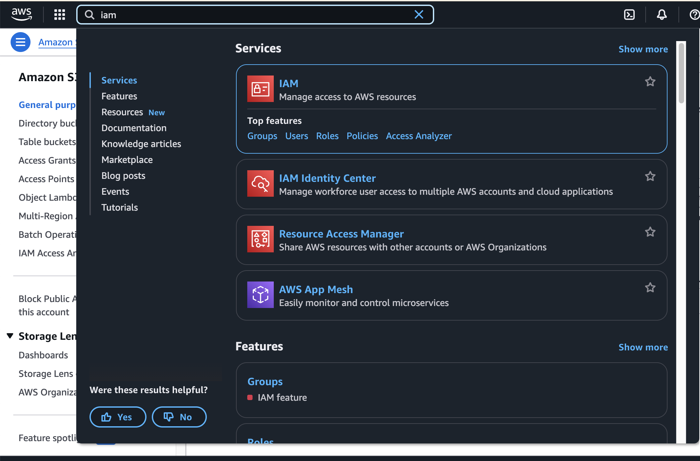

2. Now on the IAM dashboard, i clicked on "Policies."From there i searched for EC2 and selected "AmazonEC2FullAccess" from the list of policies, then clicked on "Create policy" to initiate the policy creation process.
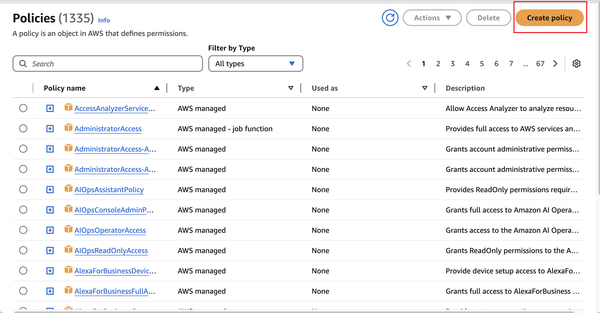
   * I then selected all EC2 actions, ticked "All resources" and clicked "Next."
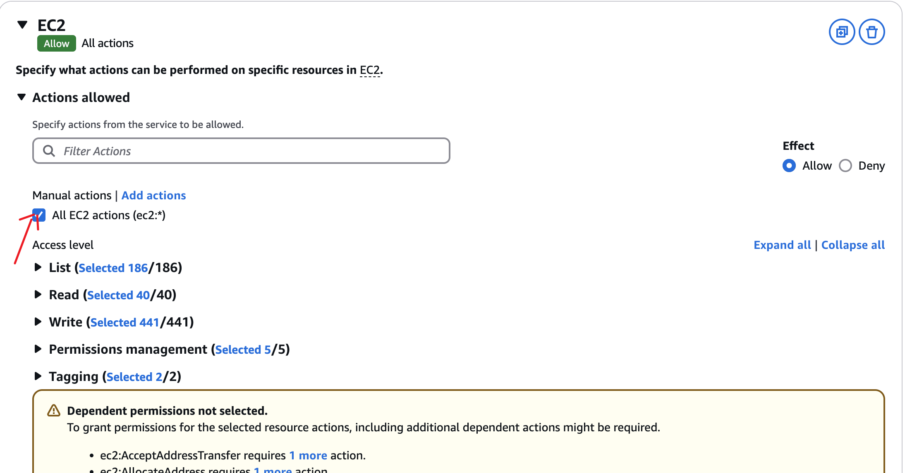

   * I then clicked on create policy.

3. I then proceeded to the "Users" section, and selected the option to "Create user".
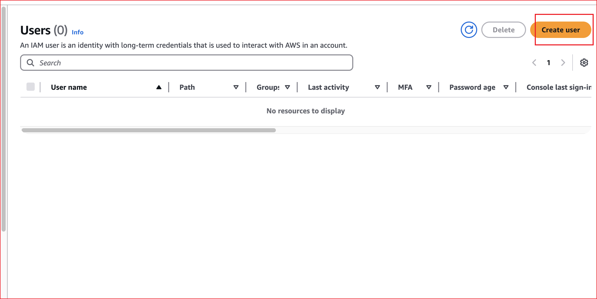

   * I entered my desired username for the user, then selected the option "Provide user access to the AWS Management Console" and proceeded to set up the password for the user. I also checked the box "Users must create a new password at next sign-in."
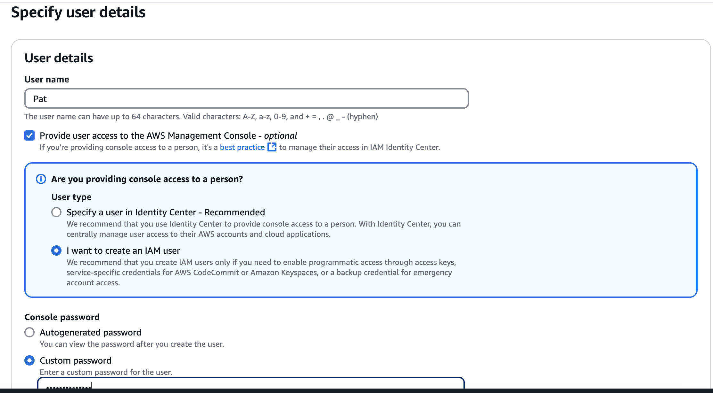

   * I selected "Attach policy directly" and navigated to "Filter customer managed policies" and chose the policy i created.
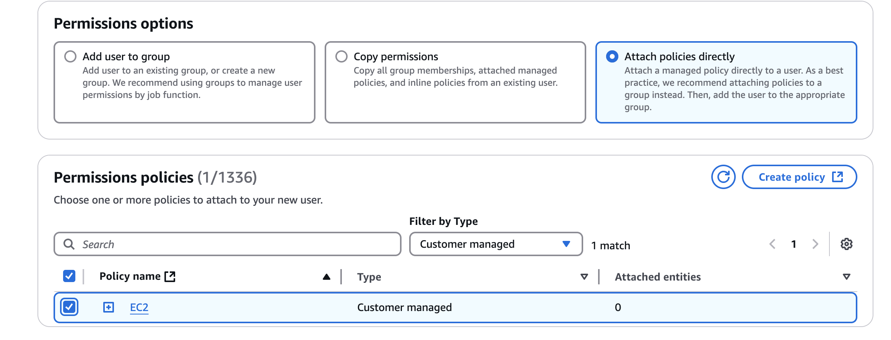
   * I then proceeded by clicking "Next" and "Create User."
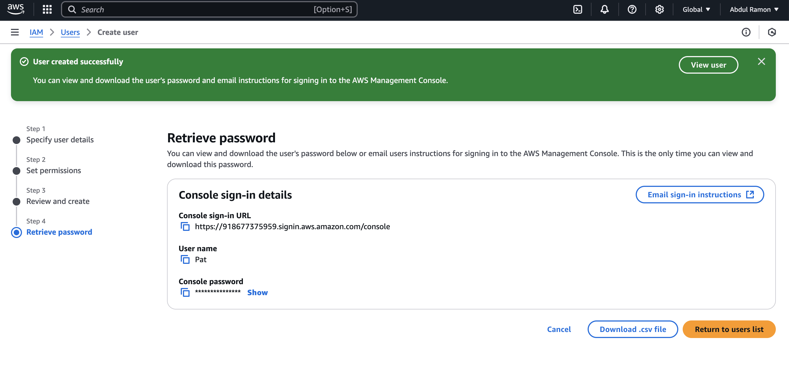

#### 2.2. Part 2

1. On the "User Groups" section, i entered a name for the group, clicked on "Create User Group", then proceeded to the "Users" section.
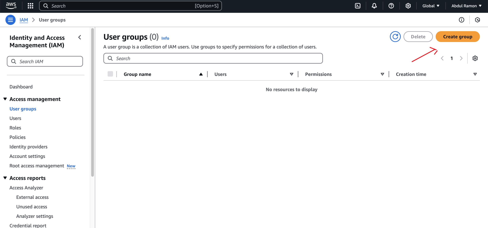
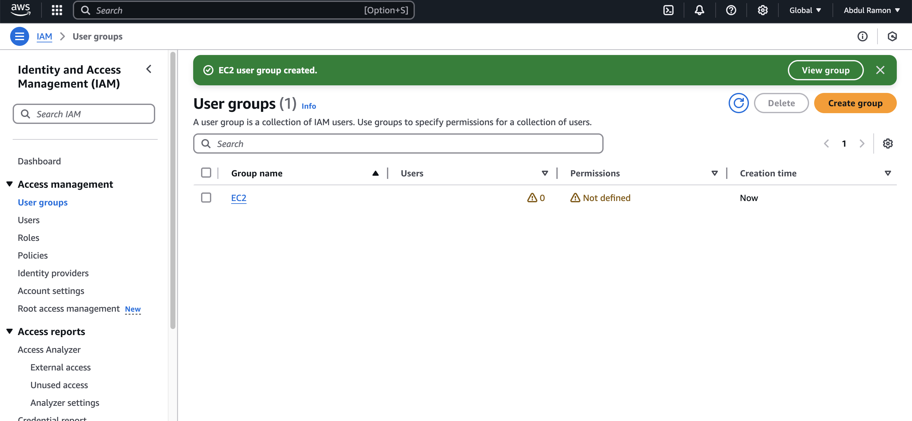

2. I created a user named Jack, In the "Permissions" options, i selected "Add user to group". Then, in the "User groups" section, i chose the group i created and clicked "Next."
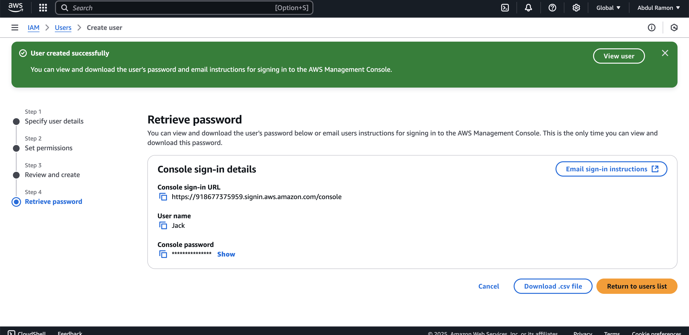
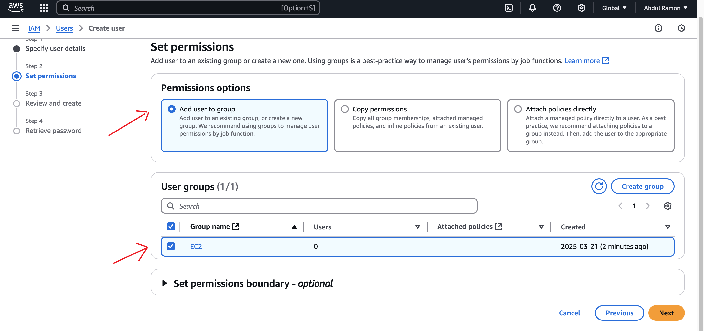
3. I then clicked on create user and repeated the same process for user Ade by creating the user Ade and adding him to the user group "Development-team."

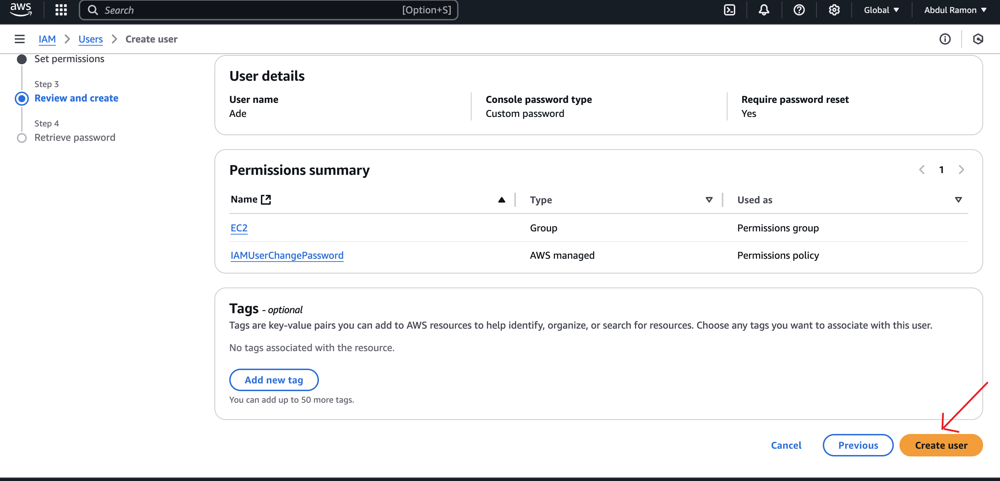

4. I navigated to the "Policies" section and clicked on "Create Policy" to start crafting a new policy.

   * I chose the 2 services, EC2 and S3.
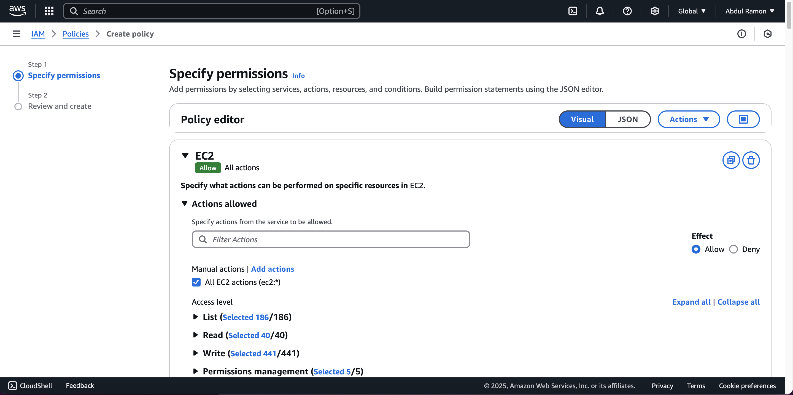
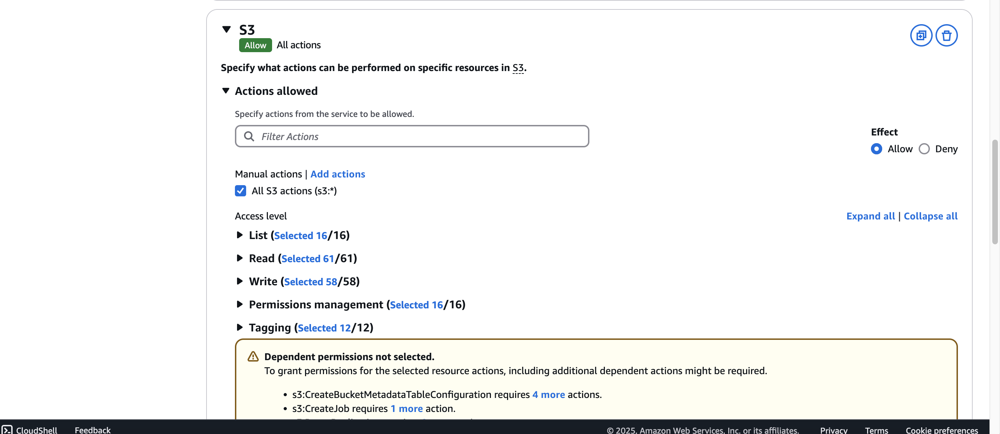
   * Entered the desired policy name and proceed to clicked on the "Create policy" button.
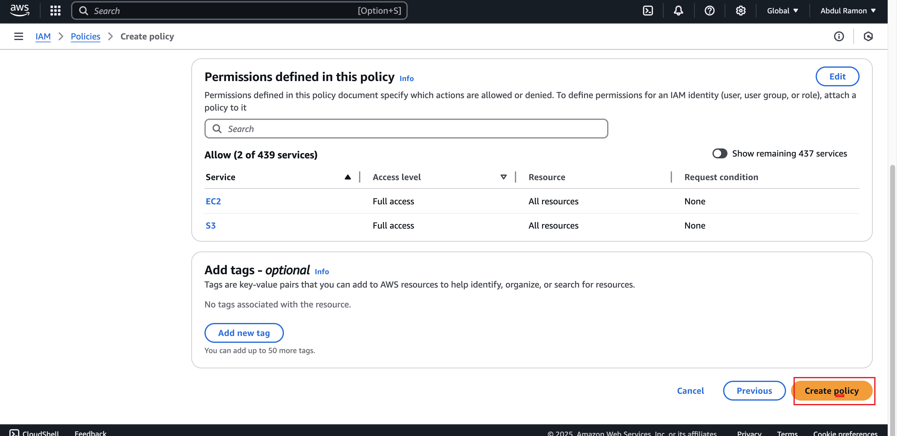

5. I navigated to the "User group" section and selected the "Development-team" group. I then proceeded to the "Permissions" section and added the neccessary permissions.
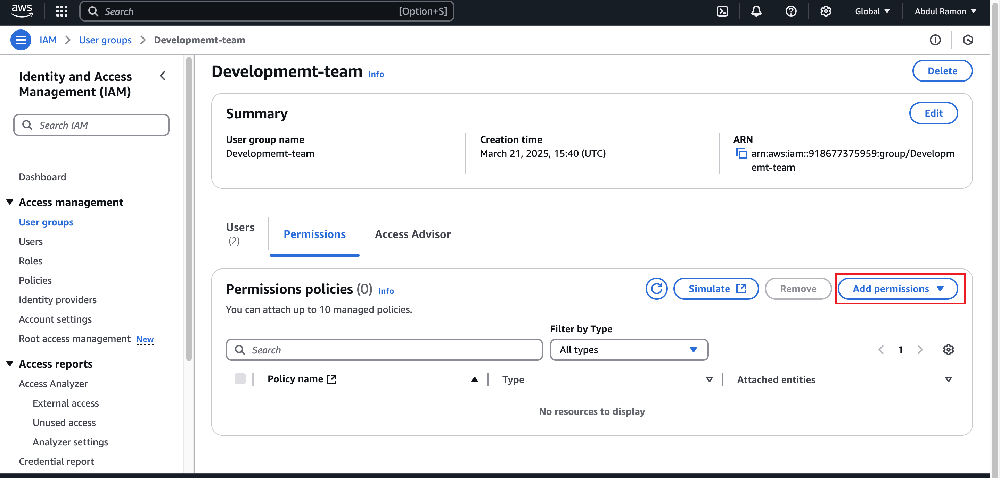

* I then clicked on attach policy, selected "Customer Managed Policy" as the policy type. Then chose the "development-policy" i created. I then clicked "Attach Policy."
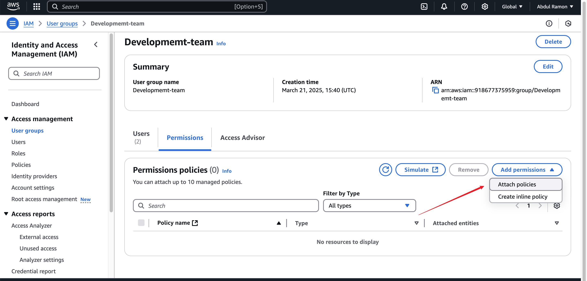

#### Troubleshooting

I can't sign in to my AWS account

Verify that you have the correct credentials and that you are using the correct method to sign in. For more information, see [Troubleshooting sign-in](https://docs.aws.amazon.com/signin/latest/userguide/troubleshooting-sign-in-issues.html) issues in the AWS Sign-In User Guide.

### Conclusion

I have successfully created and managed users, groups and roles. I implemented policies to secure AWS resources, ensuring proper access control and enhancing overall cloud security.